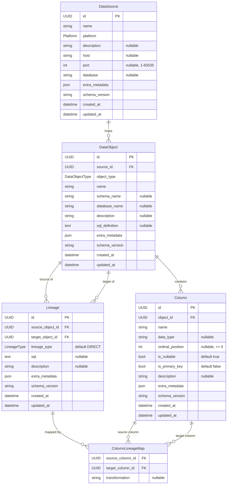

# Entity Relationship Diagram

Logical ERD for the Universal Data Lineage Tool schema (v1.1.0).
Derived from `app/models/schema.py`.

> Render this diagram in any Mermaid-aware viewer:
> GitHub, VS Code (Markdown Preview Enhanced), JetBrains IDEs, or https://mermaid.live

---

## Relationship Summary

| Relationship | Cardinality | Description |
|---|---|---|
| `DataSource` → `DataObject` | one-to-many | A platform hosts many data objects (tables, dashboards, …) |
| `DataObject` → `Column` | one-to-many | A table/view/dataset contains many columns/fields |
| `DataObject` → `Lineage` (source) | one-to-many | An object can be the upstream source of many lineage edges |
| `DataObject` → `Lineage` (target) | one-to-many | An object can be the downstream target of many lineage edges |
| `Lineage` → `ColumnLineageMap` | one-to-many | A lineage edge can carry many column-level mappings |
| `Column` → `ColumnLineageMap` (source) | one-to-many | A column can be a source in many column mappings |
| `Column` → `ColumnLineageMap` (target) | one-to-many | A column can be a target in many column mappings |

## Key Constraints

- `Lineage.source_object_id` ≠ `Lineage.target_object_id` (self-loops are rejected)
- `DataSource.port` must be in range 1–65535 when set
- `Column.ordinal_position` must be ≥ 0 when set
- All `name` fields: min length 1, max length 255
- `extra_metadata` is validated against JSON Schema definitions in `app/models/validators.py`

## Enum Values

**Platform** — `postgresql`, `mysql`, `snowflake`, `bigquery`, `redshift`, `mssql`, `oracle`, `sqlite`, `tableau`, `powerbi`, `looker`, `qlik`, `metabase`, `dbt`, `airflow`, `spark`, `kafka`, `cube`, `unknown`

**DataObjectType** — `table`, `view`, `materialized_view`, `procedure`, `function`, `dashboard`, `worksheet`, `chart`, `dataset`, `report`, `model`, `semantic_model`, `metric`, `task`, `dag`, `topic`, `unknown`

**LineageType** — `direct`, `derived`, `aggregated`, `transformed`, `reference`, `unknown`

---

*See `app/models/schema.py` for implementation and `app/models/validators.py` for metadata JSON schemas.*
